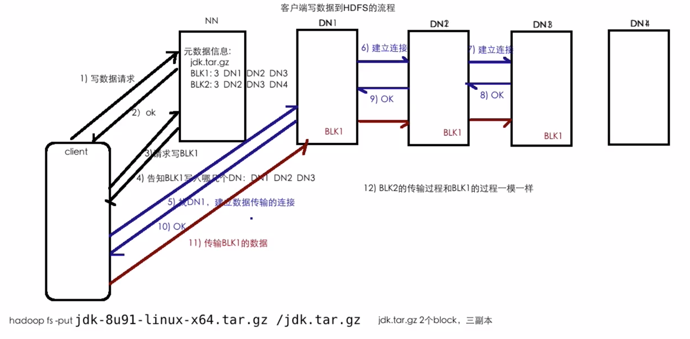
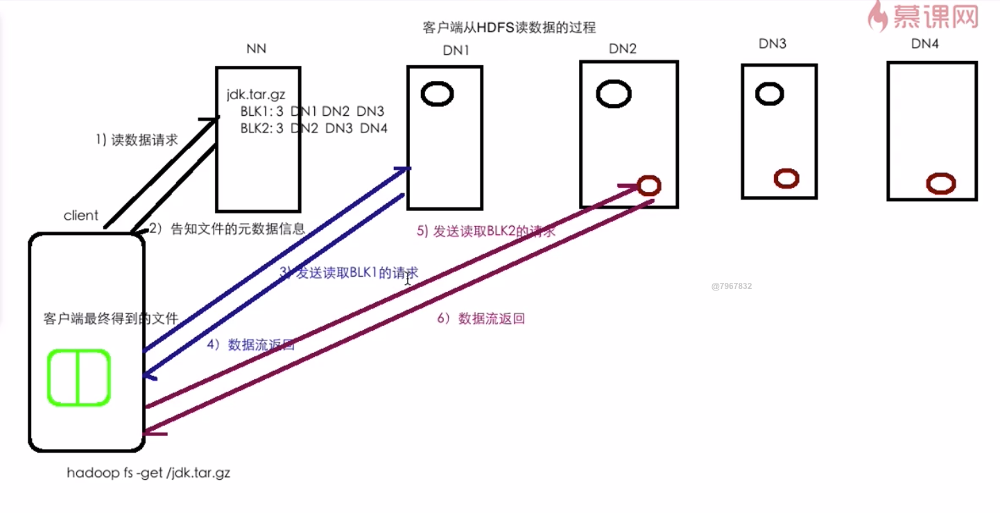
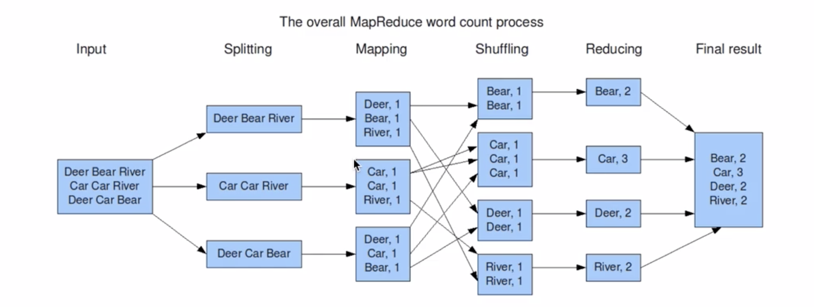
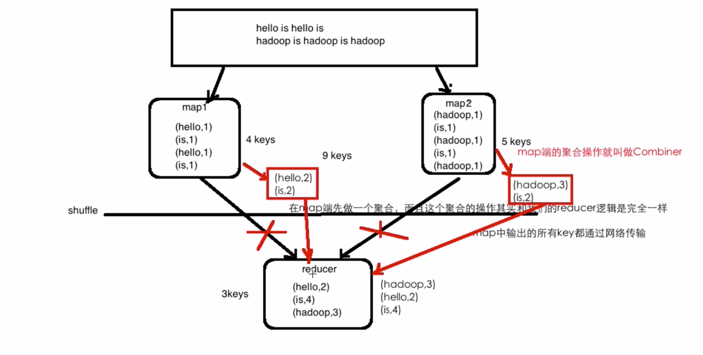
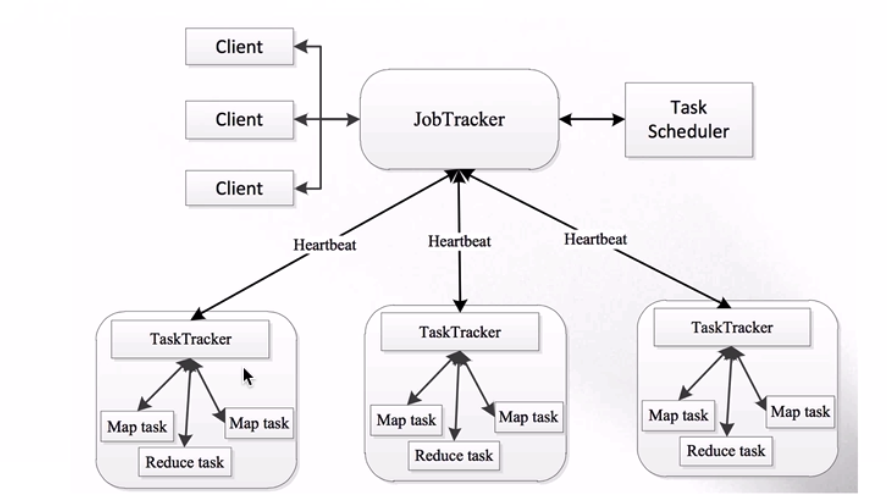
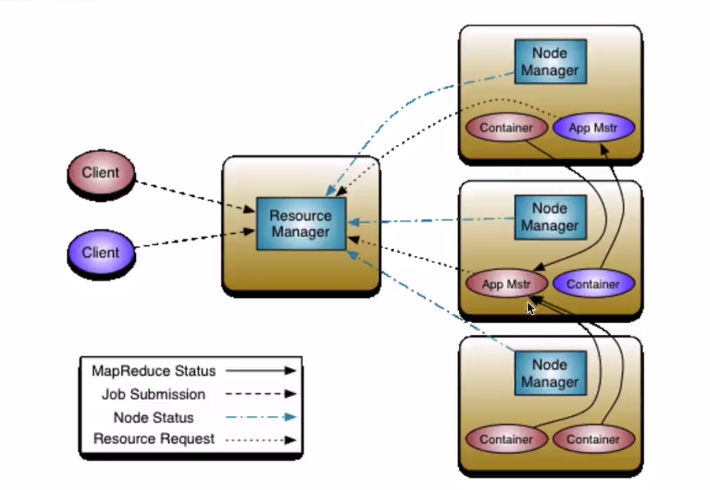
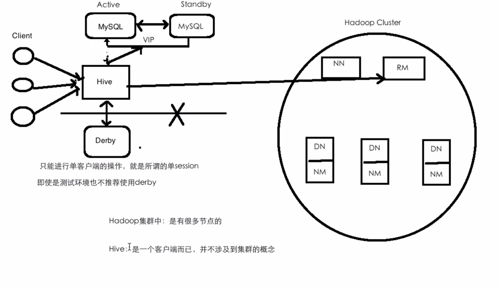

# 大数据
## 大数据的4v特征
* 数据量(volume)
* 速度(velocity)
* 多样性，复杂性(Variety)
* 基于高度分析的新价值(Value)
## 大数据带来的技术变革
* 技术驱动：数据量大
  * 存储: 文件存储 ==> 分布式存储
  * 计算: 单机    ==> 分布式计算(Map Reduce)
  * 网络: 万兆
  * 数据库: RDBMS ==> NoSQL(HBase/Redis...)
* 商业驱动
## Hadoop
创始人: Doug Cutting
hadoop.apache.org
### Hadoop概述
* 提供分布式的存储(一个文件被拆分成很多个块，并以副本的方式存储在各个节点中)和计算
* 是一个分布式的系统基础架构: 用户可以在不了解分布式底层细节的情况下进行使用。
* 分布式文件系统: HDFS实现将文件分布式存储在很多的服务器上
* 分布式计算框架：MapReduce实现在很多机器上分布式并行计算
* 分布式资源调度框架: YARN实现集群资源管理即作业的调度

### Hadoop核心组件
#### HDFS概述
* 源自Google的GFS论文，论文发表于2003年10月
* 特点: 
  * 扩展性
  * 容错性
  * 海量数据存储
* 将文件切分成指定大小的数据块并以多副本的方式存储在机器上 
文件 test.log 200M
block: 默认size=128M，2个块 = 128 * 1 + 72 * 1
副本(replica)：HDFS默认3副本

node1: blk1 blk2 (假设node1挂掉了，对结果没影响)
node2: blk2
node3: blk1 blk2
node4: 
node5: blk1
#### 计算框架MapReduce
* 源自Google的MapReduce论文
* 特点：
  * 扩展性
  * 容错性
  * 海量数据离线处理
#### 资源调度系统YARN
* Yet Another Resource Negotiator
* 负责整个集群资源的管理和调度
* 特点: 
  * 扩展性
  * 容错性
  * 多框架资源统一调度
### Hadoop优势
#### 高可靠性
* 数据存储
数据块多副本
* 数据计算
重新调度作业计算
#### 高扩展性
* 存储/计算资源不够时，可以横向地线性扩展机器
* 一个集群中可以包含数以千计的节点
#### 其他
* 存储在廉价机器上，降低成本(去IoE)
* 成熟的生态圈

### 初识Hadoop
#### 狭义Hadoop vs 广义Hadoop
* **狭义Hadoop**: 是一个适合大数据分布式存储(HDFS)、分布式计算(MapReduce)和资源调度(YARN)的平台
* **广义Hadoop**: 指的是Hadoop生态系统，Hadoop生态系统是一个很庞大的概念，Hadoop是其中最重要最基础的一个部分；生态系统中每一个子系统只解决某一个特定的问题域，不搞统一型的一个全能系统，而是小而精的多个系统

### Hadoop生态系统
#### 特点
* 开源、社区活跃

## HDFS
Hadoop Distributed File System
### 概述
* 分布式
* commodity hardware
* fault-tolerant 容错性
* high troughput 高吞吐量
* large data sets

HDFS是一个分布式文件系统
文件系统: Linux, Windows, Mac
  * 目录结构
  * 存放的是文件或文件夹
  * 对外提供服务: 创建、修改、删除、查看、移动等

|普通文件系统|分布式文件系统|
|----------|------------|
|单机|横跨n个机器|
### 前提和设计目标
#### Hardware Failure(硬件错误)
* 每个机器只存储文件的部分数据, blocksize = 128M block存放在不同的机器上, 由于容错, HDFS默认采用3副本(replica)机制
#### Streaming Data Access(流式数据访问)
* The emphasis is on high throughput of data access rather than low latency of data access.(吞吐量 > 低延时) 不适合做实时处理
#### Large Data Sets(大规模数据集)

#### Moving Computation is Cheaper than Moving Data(移动计算比移动数据更划算)
* 把计算移动到存储相关的机器上
### HDFS的架构
1. NameNode(master) and DataNodes(slave)
2. master/slave架构
3. NameNode - regulates access to files by clients
  The file system namespace
4. DataNodes: store data
5. HDFS exposes a file system namespace and allows user data to be stored in files.
6. A **file** is split into **one or more blocks**.
7. **Blocks** are stored in **a set of DataNodes**.(容错)
8. NameNode executes file system namespace operations: CRUD
9. NameNode determines the mapping of blocks to DataNodes.
    * a.txt  150M blocksize = 128M 
       * block1: 128M, 192.168.199.1
       * block2: 22M,  192.168.199.2
      get a.txt 这个过程对于用户来说是不感知的
10. 通常情况下1个Node部署1个组件
### HDFS存储扩展
1. put: 1 file ==> 1...n blocks ==> 存放在不同的节点
2. get: 去namenode上查找这个file对应的元数据信息

### HDFS 副本摆放策略
network bandwidth between machines in the same rack is greater than that between machines in different racks.
Advantages:
1. rack failure is far less than that of node failure
2. cuts the inter-rack write traffic which generally improves write performance. 
3. Reduce the aggregate network bandwidth used when reading data.

Disadvantages:
1. This policy does not impact data reliability and availability guarantees.

1. 版本1
    1. 本rack的节点上
    2. 另外一个rack的节点上
    3. 与2形同的rack的另外一个节点上
2. 版本2
    1. 本rack的一个节点上
    2. 本rack的另外一个节点上
    3. 不同rack的一个节点上
### HDFS写数据流程图详解

### HDFS读数据流程图详解

### HDFS元数据管理
* 元数据: HDFS的目录结构及每个文件的BLOCK信息(id, 副本个数、block Id)
* 存在什么地方：对应配置 ${hadoop.tmp.dir}/name/current/
* 元数据存放在文件中

### HDFS Checkpoint详解
1. NameNode: 内存->树形结构

Q1. 如果元数据都存在内存里，机器挂了咋办
* 定期将内存中的元数据序列化(serialize) 到磁盘(生成fsimage)
* edits日志，记录时间段馁所有对HDFS相关的操作指令
* 使用Secondary NameNode
    1. 复制原fsimage
    2. 复制原edits
    3. 加载磁盘文件到内存(反序列化)
    4. 将edits中记录的所有对于HDFS做的操作更新到内存中去
    5. 形成新的fsimage
    6. 把这个新的fsimage复制到原来的nameNode里

### HDFS SafeMode
* On startup, the NameNode enters a special state called Safemode. Replication of data blocks does not occur when the NameNode is in the safemode state.

## MapReduce

### 优点：
* 海量数据离线处理 
* 易开发
* 易运行
### 缺点：
* 无法处理实时流式计算

### **(面试重点)** 如何避免mapper中输出的所有key都通过网络传输到reducer？
**使用combiner**
优点：
能减少IO，提升作业的执行性能
缺点：
求平均数，除法导致小数点丢失

### **(面试重点)** Partitioner
#### 需求：将统计结果按照手机号的前缀进行区分，并输出道不同的输出文件中去
* 13* ==>
* 15* ==>
* 其他 ==>

Partitioner决定maptask输出的数据交由哪个reduce task处理
默认实现： 分发的key的hash值与reduce task个数取模

##资源调度框架YARN(Yet Another Resource Negotiator) (5-1 - 5-4)
### 产生背景

* MapReduce 1.x => MapReduce 2.x
  Master / slave : JobTracker / TaskTracker
  JobTracker: 负责Client 和 TaskTracker之间的请求通信 (**单点，压力大**)
  仅仅支持mapReduce作业
* 资源利用率
  所有的计算框架运行在一个集群中，共享一个集群的资源，按需分配
### 架构

1. **Resource management**: ResourceManager(RM) - the ultimate authority that arbitrates resources among all the applications in the system. 
    * 集群中同一时刻对外提供服务的只有1个，负责资源相关
    * 处理来自客户端的请求：提交、杀死
    * 启动/监控AM
    * 监控NM
2. **Job scheduling/monitoring**: per-application ApplicationMaster(AM) - a framework specific library and is tasked with negotiating resources from the RM and working with the NM to execute and monitor the tasks.
3. NodeManager(NM) (多个)
    * 干活
    * 想RM发送心跳信息、任务的执行情况
    * 接收来自RM的请求来启动任务
    * 处理来自AM的命令

4. Client: 想RM提交任务、杀死任务等
5. ApplicationMaster: 
    * 每个应用程序对应一个AM
    * AM想RM申请资源用于在NM上启动对应的Task
    * 数据切分
    * 为每个task(container)向RM申请资源
    * 与NM通信

6. container：任务的运行抽象
    * task是运行在container里面的
    * 可以运行AM、也可以运行mapReduce/task

## 提交自己开发的MR作业到YARN上运行的步骤：
1. `mvn clean package -DskipTests`
2. 把编译出的jar包(项目根目录/target/...jar) 以及测试数据上传到服务器
3. 将数据上传到HDFS
    `hadoop fs -put xxx hdfs/path`
4. 执行作业
    `haddop jar xxx.jar 完整的类名(类名+包名) /input/path /output/path`
5. 到YARN UI(8088) 上去观察作业的运行情况
6. 到输出目录去查看对应的输出结果

## 电商项目实战
### 用户行为日志
#### What?
* 每一次访问的行为(访问、搜索)产生的日志
* 历史行为数据 <= 历史订单 (推荐)
* 推广
* 分流(手机端、网页端、客户端)
#### Why?
* 通过产生的行为日志后台对其进行分析并能获得更多关于网站运营指标的信息

### 原始日志字段说明：
* 分隔符：^A
* 第二个字段：URL
* 第14字段：用户IP
* 第18字段：time

## 数据仓库Hive
### Hive的产生背景
* MapReduce编程的不便性 (技术门槛高，需要会Java)
* 传统RDBMS人员的需要 
        * HDFS上的文件没有schema的概念

### Hive是什么
* 由Facebook开源，用于解决海量结构化日志的数据统计问题
* 构建在Hadoop之上的数据仓库
* Hive提供的SQL查询语言：HQL
* Hive底层执行引擎支持：MR/Tez/Spark

### 为什么使用Hive
* 简单、容易上手
* 为超大数据集设计的计算/扩展能力
* 统一的元数据管理：
    Hive数据是存放在HDFS上
    元数据信息(表的名字，哪些字段和字段类型，数据存放在HDFS的位置)是存放在MySQL中

### Hive的体系架构
* Client: shell, thrift/jdbc(server/client), WebUI(HUE/Zeppelin)
* metastore:
        database: name, location, owner...
        table: name, location, owner, column name/type...

### Hive与RDBMS的区别
* 支持的
    * 都支持SQL
    * 都支持分布式集群
* 区别
    * Hive通过SQL转化成MapReduce或Spark作业然后提交到集群上运行

    * MySQL的集群比较小，部署在专门的比较昂贵的机器上
    * Hive基于Hadoop的数据仓库，集群可以很大，可部署在廉价机器上

    * MySQL的时效性比较高，一有query马上就能得到结果
    * Hive主要用在离线处理或者批处理，相对较慢

    * Hive的insert和update的效率较低
### DDL: Hive Data Definition Language
* create, delete, alter...
* Hive数据抽象/结构
    * database  HDFS一个目录
    * table     HDFS一个目录
    * partition HDFS一个目录
    * bucket    HDFS一个文件

### 默认存储路径
/user/hive/warehouse

    

